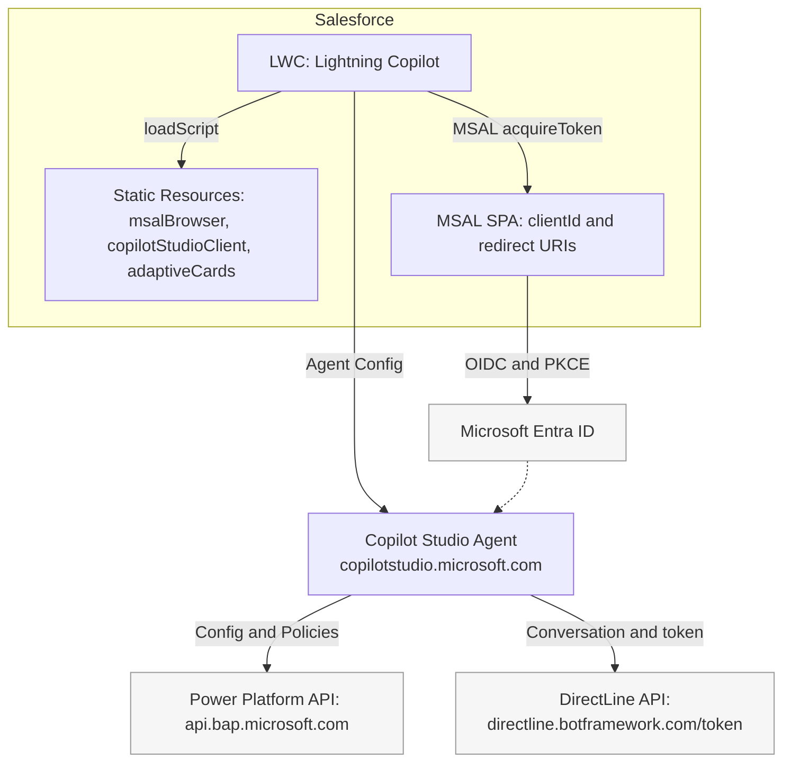
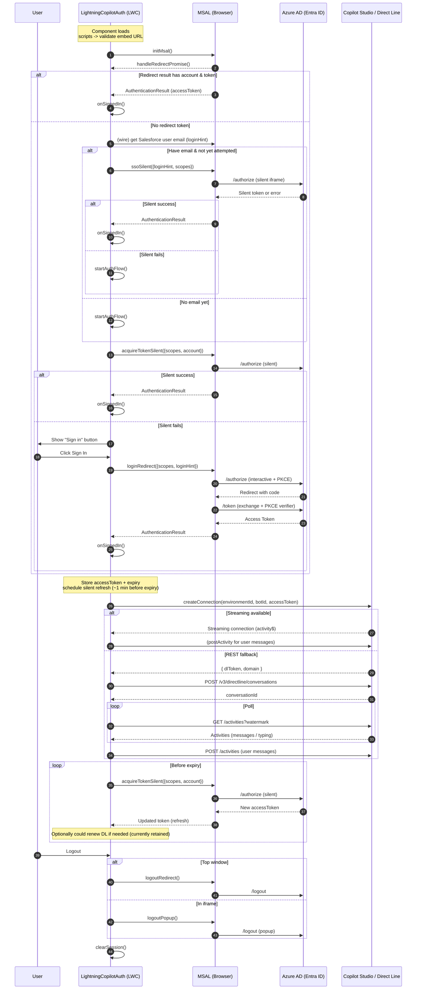

# LightningCopilot

<!-- Repo Meta -->
[](LICENSE)
[](https://github.com/brianbaldock/LightningCopilot/issues)
[](https://github.com/brianbaldock/LightningCopilot/pulls)
[](https://github.com/brianbaldock/LightningCopilot/commits/main)
[](https://github.com/brianbaldock/LightningCopilot)

<!-- Tech Stack -->
[](https://developer.mozilla.org/docs/Web/JavaScript)
[](https://nodejs.org/)
[](https://rollupjs.org/)
[](https://developer.salesforce.com/docs/component-library/documentation/en/lwc)
[](https://developer.salesforce.com/tools/sfdxcli)

<!-- Microsoft / Conversational -->
[](https://learn.microsoft.com/microsoft-copilot-studio/)
[](https://learn.microsoft.com/azure/bot-service/rest-api/bot-framework-rest-direct-line-3-0-concepts)
[](https://learn.microsoft.com/azure/active-directory/develop/msal-overview)
[](https://learn.microsoft.com/azure/active-directory/)
[](https://adaptivecards.io/)

LightningCopilot integrates Microsoft Copilot Studio agents into Salesforce via Lightning Web Components (LWC) with Entra ID (Azure AD) authentication, MSAL-based SSO, and Adaptive Cards rendering.

> This repository supplies an LWC host shell plus build assets for embedding a Copilot Studio web client inside Salesforce.

## [!IMPORTANT]

> This README provides a quick overview.  
> For deeper, step-by-step guidance, visit my blog at [brianbaldock.net](https://blog.brianbaldock.net).

## Table of contents

1. Overview
2. Features
3. Architecture
4. Prerequisites
5. Quick start
6. Configuration
7. Renaming the experience
8. Authentication flow
9. Development workflow
10. Building the Copilot bundle
11. Deployment
12. Troubleshooting
13. Security considerations
14. Contributing
15. License

## 1. Overview

LightningCopilot provides:

- A Salesforce-native host component (LWC) for Copilot chat.
- Entra ID authentication via MSAL.
- Direct Line channel negotiation.
- Inline error surfacing.
- Adaptive Cards support inside Salesforce UI.



## 2. Features

- Entra ID (Azure AD / Microsoft Entra) sign-in and sign-out.
- Event-driven integration (custom DOM events).
- Pluggable styling namespace.
- Build pipeline for Copilot Studio web client assets.
- Error isolation to reduce impact on surrounding Lightning pages.

## 3. Architecture

High-level layers:

- LWC: lightningCopilotAuth
- Helper LWC: inlineError
- Static resource bundle: built Copilot Studio client
- Authentication: MSAL (browser) + Entra ID app registration
- Conversation: Direct Line traffic brokered through the component

Data flow (simplified):
User -> LWC sign-in -> MSAL acquires token -> Direct Line starts -> Messages exchanged -> Adaptive Cards rendered.

Data flow (expanded):



## 4. Prerequisites

Install / prepare:

- Node.js (LTS) and npm.
- Salesforce CLI (sf).
- A Salesforce Org (scratch, sandbox, or production).
- Microsoft Copilot Studio bot with Direct Line channel enabled.
- Entra ID app registration:
  - SPA redirect URI(s) matching Salesforce domain(s).
  - Expose needed API permissions (if calling downstream resources).
  - Optional: logout URL.

## 5. Quick start

```bash
# Authenticate to Salesforce
sf org login web --alias MyOrg --instance-url https://login.salesforce.com
sf config set target-org MyOrg --global

# Deploy source
sf project deploy start --target-org MyOrg
```

Open the org, add the LightningCopilotAuth component to a Lightning page.

## 6. Configuration

Adjust (example placeholders):

- Entra ID client ID: in the component JS (or move to custom metadata / custom settings as needed).
- Direct Line endpoint / secret exchange: implement a server-side function or Named Credential-backed Apex if required.
- Allowed origins: ensure Salesforce domain is in Entra ID app registration redirect URIs.

## 7. Renaming the experience

To publish under a different brand:

1. Folder rename:
   - `lightningCopilot/main/default/lwc/lightningCopilotAuth` -> new folder name.
2. Class / export rename:
   - Update exported class `LightningCopilotAuth` to new name.
3. Event names:
   - Replace: `lightningcopilotauthsignin`, `lightningcopilotauthsignout`, `lightningcopilotautherror`.
4. HTML labels:
   - Change “Sign in to Lightning Copilot” to new brand text.
5. CSS namespace:
   - Root class `.lightning-copilot-shell` -> new scoped class.
6. Logging prefix:
   - Update `[LightningCopilotAuth]` occurrences.
7. sfdx-project.json:
   - Adjust package directory path if source folder renamed.
8. README:
   - Replace occurrences of LightningCopilot with new brand.

Keep naming internally consistent to avoid broken imports.

## 8. Authentication flow

1. User clicks sign in (if required)
2. MSAL initializes with Entra ID app registration.
3. Token acquisition (redirect or popup).
4. Token passed (or exchanged) for Direct Line conversation token.
5. Chat session starts; messages flow.
6. Sign-out triggers MSAL logout and emits custom event.

Events (original names):

- `lightningcopilotauthsignin`
- `lightningcopilotauthsignout`
- `lightningcopilotautherror`

## 9. Development workflow

Typical loop:

1. Modify LWC sources.
2. (Optional) Rebuild Copilot client bundle in `build-src`.
3. Deploy to target org:

   ```bash
   sf project deploy start --target-org MyOrg
   ```

4. Test in a Lightning App builder page.

Use scratch orgs for iterative development:

```bash
sf org create scratch --definition-file config/project-scratch-def.json --alias DevScratch
sf config set target-org DevScratch --global
```

## 10. Building the Copilot bundle

- Source: `build-src`
- Output (static resource): `static-resources-build`
Steps (example):

```bash
# Install dependencies
npm install
# Build (adjust script name if different)
npm run build
# Resulting assets: placed into static-resources-build for deployment
```

Ensure the static resource is referenced correctly in LWC for loading scripts.

## 11. Deployment

For sandbox / production:

1. Validate changes in a scratch org.
2. Commit and push.
3. Use source deployment or package upload if converting to unlocked package.
4. Post-deploy: verify authentication redirect domain availability in Entra ID app registration.

## 12. Troubleshooting

Issue: Sign-in loop

- Check redirect URI mismatch in Entra ID app registration.
Issue: Adaptive Card not rendering
- Confirm card JSON version compatibility.
Issue: 401 from Direct Line
- Ensure token exchange flow and secret storage handled server-side.
Issue: Events not captured
- Verify renamed custom events matched in listeners.

Logging prefix (update if renamed): `[LightningCopilotAuth]`.

## 13. Security considerations

- Never commit Direct Line secrets.
- Prefer server-mediated token exchange.
- Limit Entra ID app permissions to minimum scope.
- Consider CSP settings in Salesforce (Lightning Locker / LWC security).
- Review OWASP guidelines for embedding external scripts.

## 14. Contributing

1. Fork repository.
2. Branch: `feat/<topic>` or `fix/<issue>`.
3. Include concise commit messages.
4. Open pull request with summary and test steps.

## 15. License

Add license file if absent (e.g., MIT).

## Notes

- Update this README after significant architectural or naming changes.
- Keep configuration values externalized where possible.
